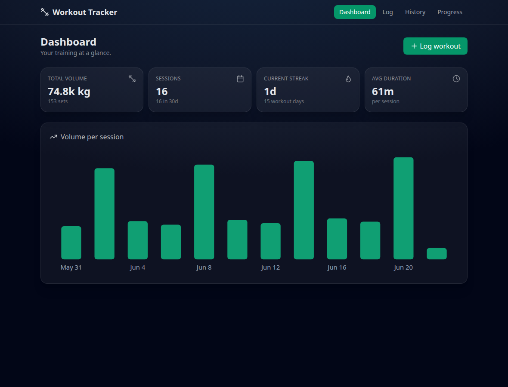
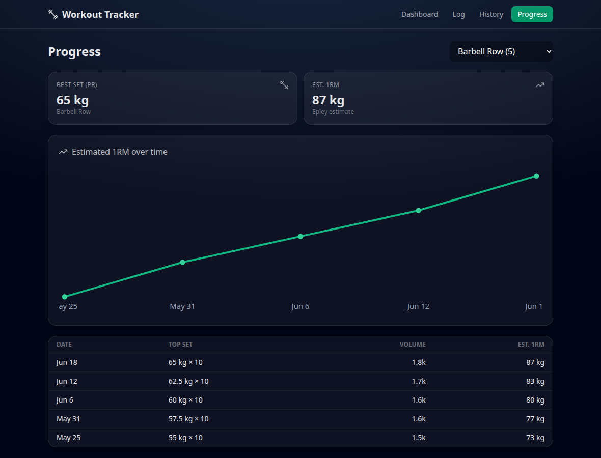
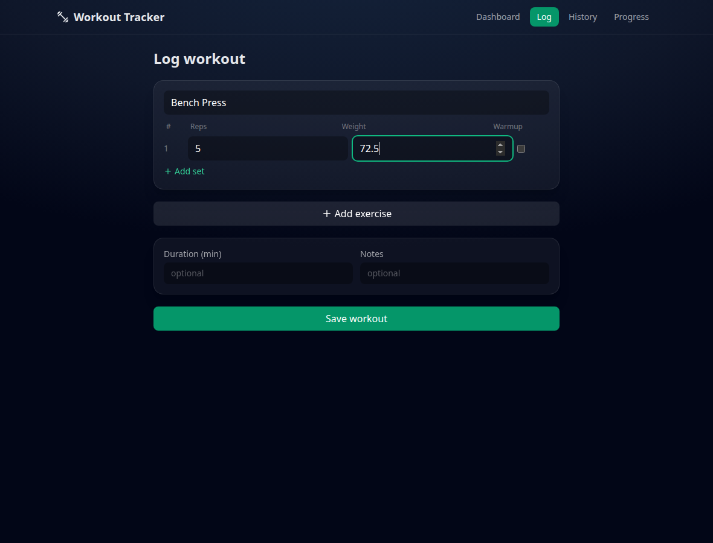
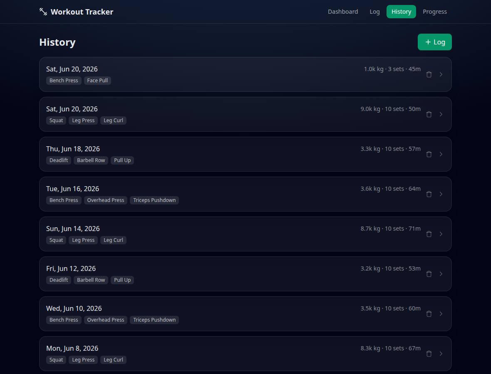

# Workout Tracker 🏋️

[](LICENSE)


A fast, self-hostable workout logger with a progress dashboard. Log your sets,
reps, and weights; see your volume, streaks, and per-exercise strength gains over
time. Runs entirely on your own machine — **no account, no cloud, no
subscription.**

## Screenshots

| Dashboard | Progress |
| --- | --- |
|  |  |

| Log a workout | History |
| --- | --- |
|  |  |

## Features

- **Fast logging** — type an exercise (reused automatically if you've done it
  before), add sets, save. Warmup sets are flagged and excluded from working
  volume.
- **Progress analytics** — per-exercise **estimated 1RM** (Epley) and best-set
  PRs charted over time, plus a per-session table.
- **Dashboard** — total volume, session count, current **streak**, workout days,
  average duration, and a volume-per-session chart.
- **History** — every session with its exercises, volume, and duration.
- **Self-hosted** — Postgres for your data, seeded with realistic demo workouts
  so the app is populated on first run.

## Quick start (Docker)

```bash
git clone <this-repo> workout-tracker
cd workout-tracker
cp .env.example .env        # defaults work out of the box
docker compose up --build
```

Open **http://localhost:8080**. The API runs on **http://localhost:4000**.
Migrations run automatically and ~5 weeks of demo workouts are seeded on first
boot (skipped once you have your own data).

## Local development

```bash
docker compose up -d postgres          # just the database

cd server && npm install
cp ../.env.example .env                 # point DATABASE_URL at localhost
npx prisma migrate dev && npm run dev   # API on :4000

cd ../client && npm install && npm run dev   # app on :5173
```

## Architecture

```
React (Vite) client ──HTTP──> Express API ──Prisma──> PostgreSQL
   /log /history /progress       /api/v1/...
```

Relational model — a session has exercises, an exercise has sets:

```
WorkoutSession ─< SessionExercise >─ Exercise
                      │
                      └─< Set (reps, weight, rpe, isWarmup)
```

Exercises are entered free-form and reused by name. All analytics (volume,
estimated 1RM, streaks, progress) live in a pure, unit-tested module
(`server/src/lib/analytics.js`).

## API (`/api/v1`)

| Method | Path | Purpose |
| --- | --- | --- |
| GET | `/analytics/summary` | dashboard totals + volume trend |
| GET | `/analytics/progress/:exerciseId` | per-session progress + PRs |
| GET / POST | `/sessions` | list / create a full session |
| GET / DELETE | `/sessions/:id` | detail / delete |
| GET / POST | `/exercises` | list / create exercises |

## Verify

```bash
cd server && npm test    # analytics unit tests (node:test)
cd client && npm run build
docker compose config --quiet
```

See [`docs/CASE_STUDY.md`](docs/CASE_STUDY.md) for the design write-up.

## Limitations & roadmap

- Single-user, no authentication (v1 scope — it's a personal tracker). Multi-user
  auth is the natural next step for a shared/deployed instance.
- Editing individual sets after saving isn't in the UI yet (delete + re-log).
- Roadmap: routine templates, rest timer, PR notifications, CSV export, PWA.

## License

[MIT](LICENSE)
